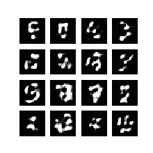
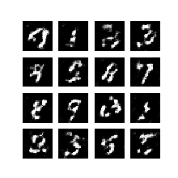
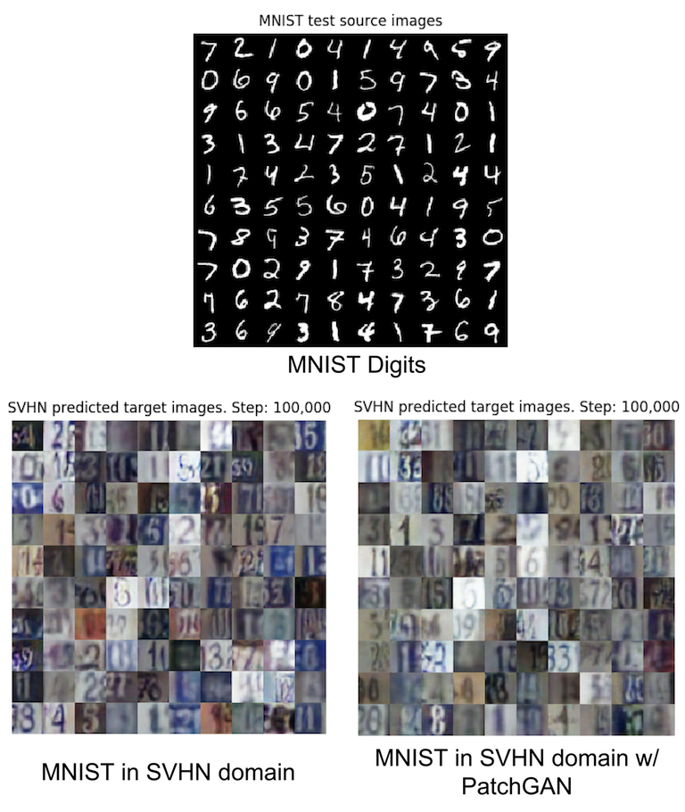
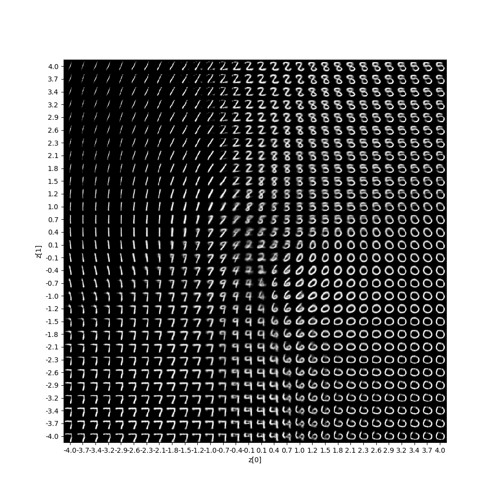
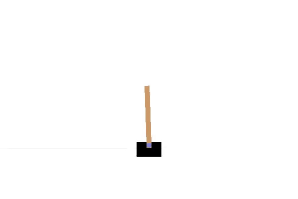
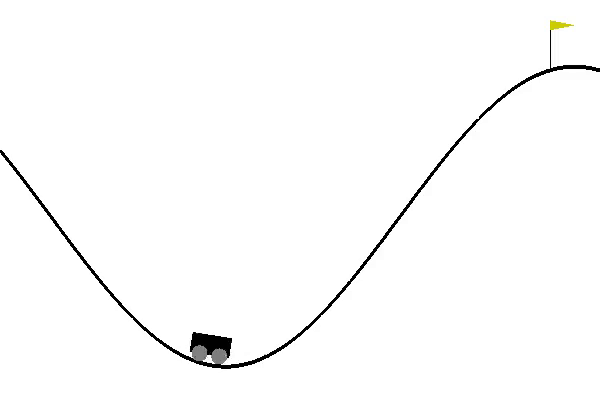
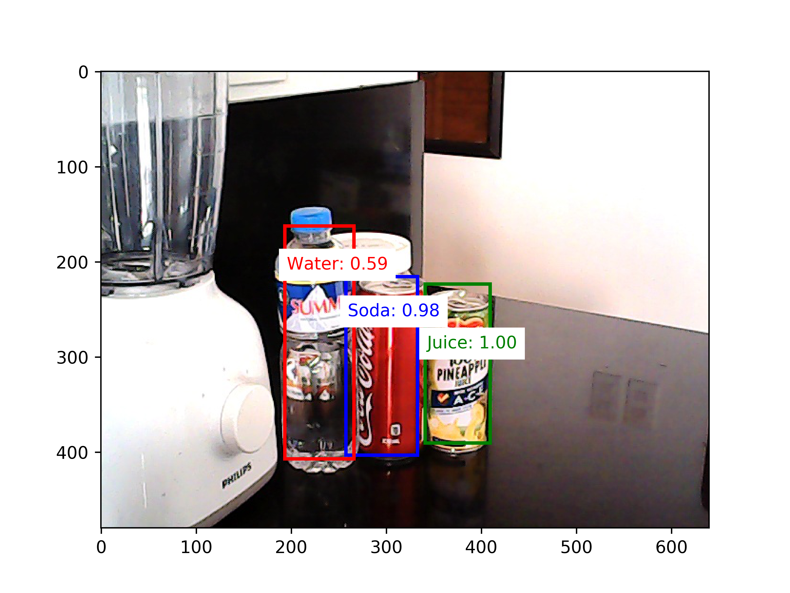

# Advanced Deep Learning with Keras (Updated for Second Edition)
This is the code repository for [Advanced Deep Learning with Keras](https://www.packtpub.com/big-data-and-business-intelligence/advanced-deep-learning-keras?utm_source=github&utm_medium=repository&utm_campaign=9781788629416), published by [Packt](https://www.packtpub.com/?utm_source=github). It contains all the supporting project files necessary to work through the book from start to finish. 

Please note that the code examples have been updated to support TensorFlow 2.0 Keras API only. 

## About the Book
This book covers advanced deep learning techniques to create successful AI. Using MLPs, CNNs, and RNNs as building blocks to more advanced techniques, you’ll study deep neural network architectures, Autoencoders, Generative Adversarial Networks (GANs), Variational AutoEncoders (VAEs), and Deep Reinforcement Learning (DRL) critical to many cutting-edge AI results.

## Instructions and Navigation
All of the code is organized into folders. Each folder starts with a number followed by the application name. For example, chapter2-deep-networks.


The code will look like the following:
```
def encoder_layer(inputs,
                  filters=16,
                  kernel_size=3,
                  strides=2,
                  activation='relu',
                  instance_norm=True):
"""Builds a generic encoder layer made of Conv2D-IN-LeakyReLU 
IN is optional, LeakyReLU may be replaced by ReLU
"""
conv = Conv2D(filters=filters,
              kernel_size=kernel_size,
              strides=strides,
              padding='same')
```

## Related Products
* [Deep Reinforcement Learning Hands-On](https://www.packtpub.com/big-data-and-business-intelligence/deep-reinforcement-learning-hands?utm_source=github&utm_medium=repository&utm_campaign=9781788834247)

* [Deep Learning with Keras](https://www.packtpub.com/big-data-and-business-intelligence/deep-learning-keras?utm_source=github&utm_medium=repository&utm_campaign=9781787128422)

* [Reinforcement Learning with TensorFlow](https://www.packtpub.com/big-data-and-business-intelligence/reinforcement-learning-tensorflow?utm_source=github&utm_medium=repository&utm_campaign=9781788835725)


# [Advanced Deep Learning with Keras](http://a.co/d/e55mrQc) sample code used in the book

## [Chapter 1 - Introduction](chapter1-keras-quick-tour)
1. [MLP on MNIST](chapter1-keras-quick-tour/mlp-mnist-1.3.2.py)
2. [CNN on MNIST](chapter1-keras-quick-tour/cnn-mnist-1.4.1.py)
3. [RNN on MNIST](chapter1-keras-quick-tour/rnn-mnist-1.5.1.py)

## [Chapter 2 - Deep Networks](chapter2-deep-networks)
1. [Functional API on MNIST](chapter2-deep-networks/cnn-functional-2.1.1.py)
2. [Y-Network on MNIST](chapter2-deep-networks/cnn-y-network-2.1.2.py)
3. [ResNet v1 and v2 on CIFAR10](chapter2-deep-networks/resnet-cifar10-2.2.1.py)
4. [DenseNet on CIFAR10](chapter2-deep-networks/densenet-cifar10-2.4.1.py)

## [Chapter 3 - AutoEncoders](chapter3-autoencoders)
1. [Denoising AutoEncoders](chapter3-autoencoders/denoising-autoencoder-mnist-3.3.1.py)

Sample outputs for random digits:


2. [Colorization AutoEncoder](chapter3-autoencoders/colorization-autoencoder-cifar10-3.4.1.py)


Sample outputs for random cifar10 images:


## [Chapter 4 - Generative Adversarial Network (GAN)](chapter4-gan)
1. [Deep Convolutional GAN (DCGAN)](chapter4-gan/dcgan-mnist-4.2.1.py)

[Radford, Alec, Luke Metz, and Soumith Chintala. "Unsupervised representation learning with deep convolutional generative adversarial networks." arXiv preprint arXiv:1511.06434 (2015).](https://arxiv.org/pdf/1511.06434.pdf%C3%AF%C2%BC%E2%80%B0)

Sample outputs for random digits:


2. [Conditional (GAN)](chapter4-gan/cgan-mnist-4.3.1.py)

[Mirza, Mehdi, and Simon Osindero. "Conditional generative adversarial nets." arXiv preprint arXiv:1411.1784 (2014).](https://arxiv.org/pdf/1411.1784)

Sample outputs for digits 0 to 9:


## [Chapter 5 - Improved GAN](chapter5-improved-gan)
1. [Wasserstein GAN (WGAN)](chapter5-improved-gan/wgan-mnist-5.1.2.py)

[Arjovsky, Martin, Soumith Chintala, and Léon Bottou. "Wasserstein GAN." arXiv preprint arXiv:1701.07875 (2017).](https://arxiv.org/pdf/1701.07875)

Sample outputs for random digits:



2. [Least Squares GAN (LSGAN)](chapter5-improved-gan/lsgan-mnist-5.2.1.py)

[Mao, Xudong, et al. "Least squares generative adversarial networks." 2017 IEEE International Conference on Computer Vision (ICCV). IEEE, 2017.](http://openaccess.thecvf.com/content_ICCV_2017/papers/Mao_Least_Squares_Generative_ICCV_2017_paper.pdf)

Sample outputs for random digits:


3. [Auxiliary Classfier GAN (ACGAN)](chapter5-improved-gan/acgan-mnist-5.3.1.py)

[Odena, Augustus, Christopher Olah, and Jonathon Shlens. "Conditional image synthesis with auxiliary classifier GANs. Proceedings of the 34th International Conference on Machine Learning, Sydney, Australia, PMLR 70, 2017."](http://proceedings.mlr.press/v70/odena17a.html)

Sample outputs for digits 0 to 9:


## [Chapter 6 - GAN with Disentangled Latent Representations](chapter6-disentangled-gan)
1. [Information Maximizing GAN (InfoGAN)](chapter6-disentangled-gan/infogan-mnist-6.1.1.py)

[Chen, Xi, et al. "Infogan: Interpretable representation learning by information maximizing generative adversarial nets." 
Advances in Neural Information Processing Systems. 2016.](http://papers.nips.cc/paper/6399-infogan-interpretable-representation-learning-by-information-maximizing-generative-adversarial-nets.pdf)

Sample outputs for digits 0 to 9:



2. [Stacked GAN](chapter6-disentangled-gan/stackedgan-mnist-6.2.1.py)

[Huang, Xun, et al. "Stacked generative adversarial networks." IEEE Conference on Computer Vision and Pattern Recognition (CVPR). Vol. 2. 2017](http://openaccess.thecvf.com/content_cvpr_2017/papers/Huang_Stacked_Generative_Adversarial_CVPR_2017_paper.pdf)

Sample outputs for digits 0 to 9:


## [Chapter 7 - Cross-Domain GAN](chapter7-cross-domain-gan)
1. [CycleGAN](chapter7-cross-domain-gan/cyclegan-7.1.1.py)

[Zhu, Jun-Yan, et al. "Unpaired Image-to-Image Translation Using Cycle-Consistent Adversarial Networks." 2017 IEEE International Conference on Computer Vision (ICCV). IEEE, 2017.](http://openaccess.thecvf.com/content_ICCV_2017/papers/Zhu_Unpaired_Image-To-Image_Translation_ICCV_2017_paper.pdf)

Sample outputs for random cifar10 images:


Sample outputs for MNIST to SVHN:



## [Chapter 8 - Variational Autoencoders (VAE)](chapter8-vae)

1. [VAE MLP MNIST](chapter8-vae/vae-mlp-mnist-8.1.1.py)
2. [VAE CNN MNIST](chapter8-vae/cvae-cnn-mnist-8.2.1.py)
3. [Conditional VAE and Beta VAE](chapter8-vae/cvae-cnn-mnist-8.2.1.py)

[Kingma, Diederik P., and Max Welling. "Auto-encoding Variational Bayes." arXiv preprint arXiv:1312.6114 (2013).](https://arxiv.org/pdf/1312.6114.pdf)

[Sohn, Kihyuk, Honglak Lee, and Xinchen Yan. "Learning structured output representation using deep conditional generative models." Advances in Neural Information Processing Systems. 2015.](http://papers.nips.cc/paper/5775-learning-structured-output-representation-using-deep-conditional-generative-models.pdf)

[I. Higgins, L. Matthey, A. Pal, C. Burgess, X. Glorot, M. Botvinick, S. Mohamed, and A. Lerchner. β-VAE: Learning basic visual concepts with a constrained variational framework. ICLR, 2017.](https://openreview.net/pdf?id=Sy2fzU9gl)

Generated MNIST by navigating the latent space:



## [Chapter 9 - Deep Reinforcement Learning](chapter9-drl)

1. [Q-Learning](chapter9-drl/q-learning-9.3.1.py)
2. [Q-Learning on Frozen Lake Environment](chapter9-drl/q-frozenlake-9.5.1.py)
3. [DQN and DDQN on Cartpole Environment](chapter9-drl/dqn-cartpole-9.6.1.py)

Mnih, Volodymyr, et al. "Human-level control through deep reinforcement learning." Nature 518.7540 (2015): 529

DQN on Cartpole Environment:



## [Chapter 10 - Policy Gradient Methods](chapter10-policy)

1. [REINFORCE, REINFORCE with Baseline, Actor-Critic, A2C](chapter10-policy/policygradient-car-10.1.1.py)

[Sutton and Barto, Reinforcement Learning: An Introduction ](http://incompleteideas.net/book/bookdraft2017nov5.pdf)

[Mnih, Volodymyr, et al. "Asynchronous methods for deep reinforcement learning." International conference on machine learning. 2016.](http://proceedings.mlr.press/v48/mniha16.pdf)


Policy Gradient on MountainCar Continuous Environment:




## [Chapter 11 - Object Detection](chapter11-detection)

1. [Single-Shot Detection](https://arxiv.org/pdf/1512.02325.pdf)

Single-Shot Detection on 3 Objects


## [Chapter 12 - Semantic Segmentation](chapter12-segmenntation)

1. [FCN](https://www.cv-foundation.org/openaccess/content_cvpr_2015/papers/Long_Fully_Convolutional_Networks_2015_CVPR_paper.pdf)

2. [PSPNet](http://openaccess.thecvf.com/content_cvpr_2017/papers/Zhao_Pyramid_Scene_Parsing_CVPR_2017_paper.pdf)

Semantic Segmentation


## Citation
If you find this work useful, please cite:

```
@book{atienza2018advanced,
  title={Advanced Deep Learning with Keras},
  author={Atienza, Rowel},
  year={2018},
  publisher={Packt Publishing Ltd}
}
```

