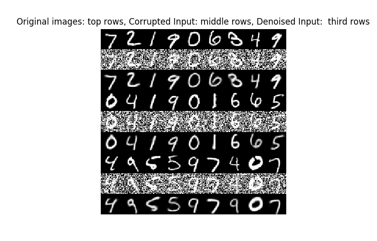
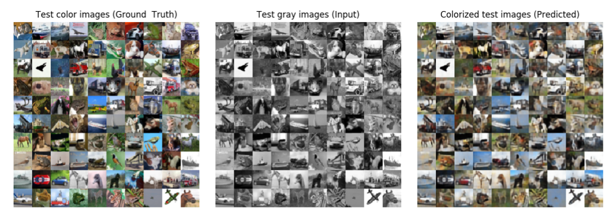
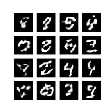
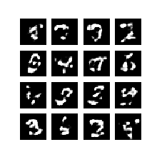

# [Advanced Deep Learning with Keras](http://a.co/d/45NPFvY) book Keras code

## [Chapter 1 - Introduction](chapter1-keras-quick-tour)
1. [MLP on MNIST](chapter1-keras-quick-tour/mlp-mnist-1.3.2.py)
2. [CNN on MNIST](chapter1-keras-quick-tour/cnn-mnist-1.4.1.py)
3. [RNN on MNIST](chapter1-keras-quick-tour/rnn-mnist-1.5.1.py)

## [Chapter 2 - Deep Networks](chapter2-deep-networks)
1. [Functional API on MNIST](chapter2-deep-networks/cnn-functional-2.1.1.py)
2. [Y-Network on MNIST](chapter2-deep-networks/cnn-y-network-2.1.2.py)
3. [ResNet v1 and v2 on CIFAR10](chapter2-deep-networks/resnet-cifar10-2.2.1.py)
4. [DenseNet on CIFAR10](chapter2-deep-networks/densenet-cifar10-2.4.1.py)

## [Chapter 3 - AutoEncoders](chapter3-autoencoders)
1. [Denoising AutoEncoders](chapter3-autoencoders/denoising-autoencoder-mnist-3.3.1.py)

Sample outputs for random digits:



2. [Colorization AutoEncoder](chapter3-autoencoders/colorization-autoencoder-cifar10-3.4.1.py)


Sample outputs for random cifar10 images:


## [Chapter 4 - Generative Adversarial Network (GAN)](chapter4-gan)
1. [Deep Convolutional GAN (DCGAN)](chapter4-gan/dcgan-mnist-4.2.1.py)

[Radford, Alec, Luke Metz, and Soumith Chintala. "Unsupervised representation learning with deep convolutional generative adversarial networks." arXiv preprint arXiv:1511.06434 (2015).](https://arxiv.org/pdf/1511.06434.pdf%C3%AF%C2%BC%E2%80%B0)

Sample outputs for random digits:



2. [Conditional (GAN)](chapter4-gan/cgan-mnist-4.3.1.py)

[Mirza, Mehdi, and Simon Osindero. "Conditional generative adversarial nets." arXiv preprint arXiv:1411.1784 (2014).](https://arxiv.org/pdf/1411.1784)

Sample outputs for digits 0 to 9:


## [Chapter 5 - Improved GAN](chapter5-improved-gan)
1. [Wasserstein GAN (WGAN)](chapter5-improved-gan/wgan-mnist-5.1.2.py)

[Arjovsky, Martin, Soumith Chintala, and Léon Bottou. "Wasserstein GAN." arXiv preprint arXiv:1701.07875 (2017).](https://arxiv.org/pdf/1701.07875)

Sample outputs for random digits:


2. [Least Squares GAN (LSGAN)](chapter5-improved-gan/lsgan-mnist-5.2.1.py)

[Mao, Xudong, et al. "Least squares generative adversarial networks." 2017 IEEE International Conference on Computer Vision (ICCV). IEEE, 2017.](http://openaccess.thecvf.com/content_ICCV_2017/papers/Mao_Least_Squares_Generative_ICCV_2017_paper.pdf)

Sample outputs for random digits:



3. [Auxiliary Classfier GAN (ACGAN)](chapter5-improved-gan/acgan-mnist-5.3.1.py)

[Odena, Augustus, Christopher Olah, and Jonathon Shlens. "Conditional image synthesis with auxiliary classifier GANs. Proceedings of the 34th International Conference on Machine Learning, Sydney, Australia, PMLR 70, 2017."](http://proceedings.mlr.press/v70/odena17a.html)

Sample outputs for digits 0 to 9:


## [Chapter 6 - GAN with Disentangled Latent Representations](chapter6-disentangled-gan)
1. [Information Maximizing GAN (InfoGAN)](chapter6-disentangled-gan/infogan-mnist-6.1.1.py)

[Chen, Xi, et al. "Infogan: Interpretable representation learning by information maximizing generative adversarial nets." 
Advances in Neural Information Processing Systems. 2016.](http://papers.nips.cc/paper/6399-infogan-interpretable-representation-learning-by-information-maximizing-generative-adversarial-nets.pdf)

Sample outputs for digits 0 to 9:


2. [Stacked GAN](chapter6-disentangled-gan/stackedgan-mnist-6.2.1.py)

[Huang, Xun, et al. "Stacked generative adversarial networks." IEEE Conference on Computer Vision and Pattern Recognition (CVPR). Vol. 2. 2017](http://openaccess.thecvf.com/content_cvpr_2017/papers/Huang_Stacked_Generative_Adversarial_CVPR_2017_paper.pdf)

Sample outputs for digits 0 to 9:


## [Chapter 7 - Cross-Domain GAN](chapter7-cross-domain-gan)
1. [CycleGAN](chapter7-cross-domain-gan/cyclegan-7.1.1.py)

[Zhu, Jun-Yan, et al. "Unpaired Image-to-Image Translation Using Cycle-Consistent Adversarial Networks." 2017 IEEE International Conference on Computer Vision (ICCV). IEEE, 2017.](http://openaccess.thecvf.com/content_ICCV_2017/papers/Zhu_Unpaired_Image-To-Image_Translation_ICCV_2017_paper.pdf)

Sample outputs for random cifar10 images:


Sample outputs for MNIST to SVHN:


## Citation
If you find this work useful, please cite:

```
@book{atienza2018advanced,
  title={Advanced Deep Learning with Keras},
  author={Atienza, Rowel},
  year={2018},
  publisher={Packt Publishing Ltd}
}
```

